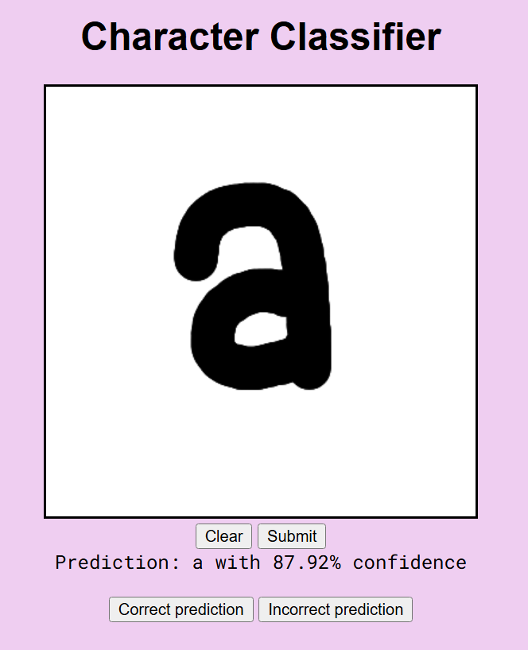
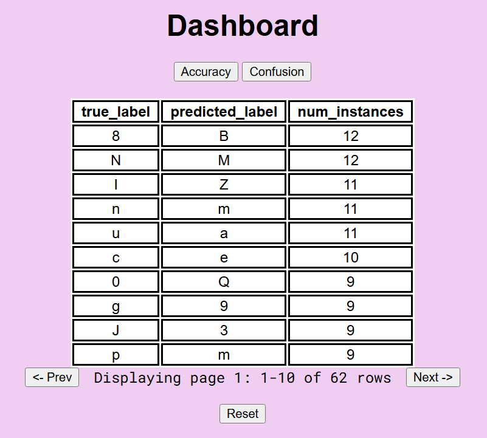
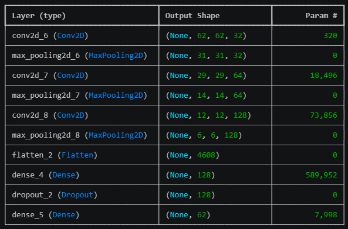
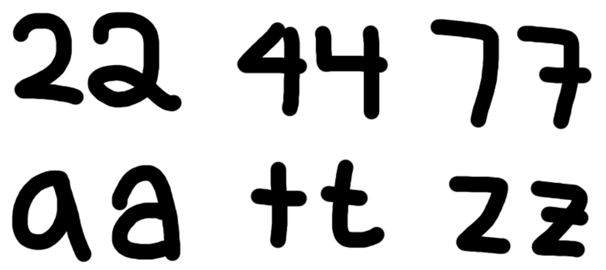
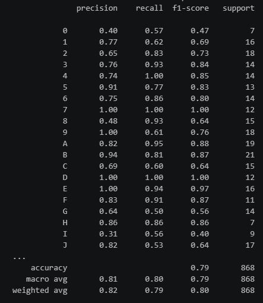

# Project Overview
ML classifier for handwritten characters which stores user feedback in a PostgreSQL database for monitoring, analytics, and improvement.  

The classifier is a Convolutional Neural Network (CNN) which classifies handwritten characters (0-9, A-Z, a-z).  
Users can draw a character on the canvas and the model will attempt to predict which character it is.  
Users can also provide feedback for the model's predictions to help improve accuracy.
  
  

## Libraries
- Flask
- tensorflow
- numpy
- Pillow
- python-dotenv
- psycopg
- pandas
- sklearn

## Dataset
The classifier was originally trained with this image set downloaded via Kaggle: [https://www.kaggle.com/datasets/dhruvildave/english-handwritten-characters-dataset](https://www.kaggle.com/datasets/dhruvildave/english-handwritten-characters-dataset)  
Includes 62 different characters (0-9, A-Z, a-z) with 55 samples from each class.  

Running the demo loads the PostgreSQL database with a seed including the two models I created and 930 entries to explore with analytical SQL queries.  
See [Dataset Extension](#dataset-extension) for more info.  

## Schema
A PostgreSQL database is used to keep track of model versions and user predictions.  
- 'models': stores model name, file path, date of creation, and additional notes  
- 'predictions: stores true label, predicted label, image data, success or failure, prediction confidence, model used, and date of creation  

## Running locally
1. Download and install Docker Desktop  
2. Clone the repository and navigate into the root directory 
3. In the terminal, run the following command:  
```docker compose up --build```  
4. The demo will be running on http://localhost:5000/  
5. When you're done, run:  
```docker compose stop```  
6. You can start the app again with:  
```docker compose up```  
7. You can wipe everything and start over with:  
```docker compose down -v```  
```docker compose up --build```  

# Initial method
## Preprocessing
Inputs are resized to 64x64, converted to grayscale, and normalized before training/prediction. I used an 80/20 train/test split.

## Model
The ML model uses a convolutional neural network consisting of three convolutional layers with 32, 64, and 128 filters, respectively. Each layer uses ReLU activation and subsequently 2x2 max pooling. The output is then flattened and passed through a fully connected layer with 128 ReLU neurons. A 30% dropout layer is used to reduce overfitting before the final softmax layer with 62 outputs corresponding to the 62 classes.  


## Evaluation
I compared the CNN model to a simple 1NN Euclidean distance classifier. I found that the 1NN classifier achieved roughly 41% accuracy on the test set while the CNN classifier achieved around 74% accuracy.  

## Observed issues
Many of the classes look very similar, especially to an image classifier. For example, consider the sets {1, I, i, j, l}, {0, O, o}, {2, Z, z}, to name a few.  
There are also examples of letters where the upper and lower case versions look nearly identical: {C, c} {K, k}, {O, o}, {P, p}, {S, s}, {U, u}, {V, v}, {W, w}, {X, x}, {Z, z}  
There are also characters that can be written in different styles: {2, 4, 7, a, t, z}  

# Improvements
## Immediate changes
I found that removing the dropout layer caused severe overfitting. It allowed the CNN to reach over 90% accuracy on the training set, but test accuracy dropped below 70%.   
I also had to adjust the canvas size and brush thickness to try to emulate the resolution of the training dataset. After tweaking these parameters, the demo saw great improvement in prediction performance.

## Feedback feature
I thought it would be an interesting idea to allow users to upload their character drawings to help expand the dataset.  
I implemented a feature which inserts the user's image and character label as entries into a database table. These additional data points can be used to retrain the model and improve classification accuracy.  
Of course, for the purposes of the demo, there is no verification of user drawings. I assume that there are no malicious users and only accurate responses are submitted.

## Dataset extension
The original model I trained was using for the demo was having an issue where it could not predict ['1', 'I', 'N', 'i'] (0% success rate in the demo). It also was struggling to recognize lowercase characters.  
I figured the best way to fix this issue was to retrain the model with more samples. I spent some time to hand draw 15 samples of each class, creating an [additional dataset](./data/extra/extra.zip) with 930 new samples in total.  
I was excited to find that this was able to bring the model's test accuracy up to 79%.  
  
You can observe the improvements by trying out the new model. It's now able to consistently recognize the characters with very high confidence.

## Conclusion
Although this is a very simple application of the CNN, I was very pleased to see how well it performs.  
I was surprised how large of an improvement I saw by simply adding 15 samples to each class. Admittedly, I suspect much of the inaccuracy can be attributed to the resolution difference between the canvas and the original dataset. Additionally, the thickness of the brush size also had an effect on prediction accuracy (though I tried to get it as close as possible).  
Another interesting idea to explore in the future is to train an ML model that can read a sequence of handwritten characters (names, words, sentences, etc).  

# References
de Campos, T. E., Babu, B. R., & Varma, M. (2009). *Character recognition in natural images*. Proceedings of the International Conference on Computer Vision Theory and Applications, Lisbon, Portugal.  
Convolutional Neural Network Tutorial via TensorFlow [https://www.tensorflow.org/tutorials/images/cnn](https://www.tensorflow.org/tutorials/images/cnn)  

# AI Disclaimer
I used ChatGPT as a tool to learn new skills and assist with debugging during development. It was useful for brainstorming ideas, troubleshooting errors, and implementing various features--especially web deployment and Dockerization. 
